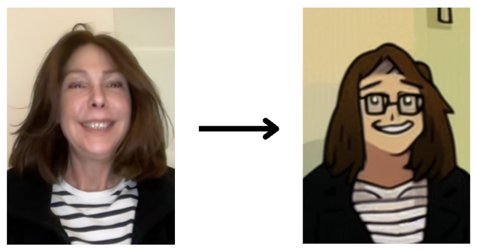
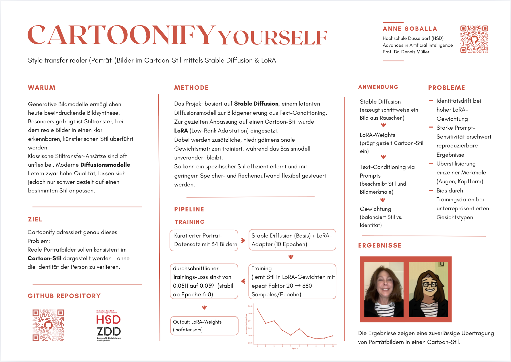
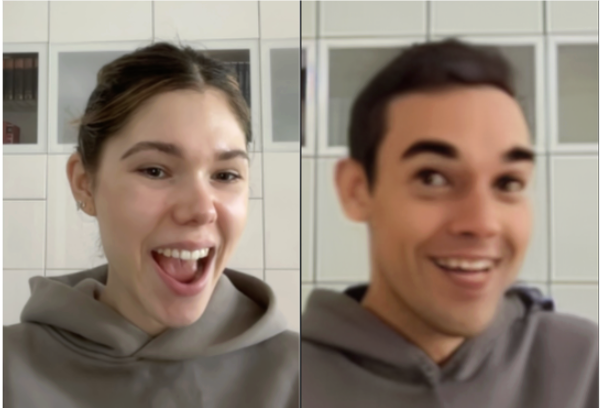
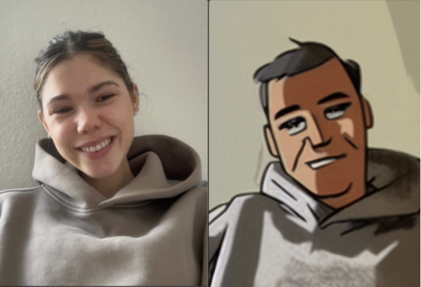

# Cartoonify


**Transform photos into cartoon-style images using Stable Diffusion with custom LoRA models.**

Cartoonify is a full-stack application that converts real photos into stylized cartoon portraits using Stable Diffusion 1.5 with fine-tuned LoRA (Low-Rank Adaptation) models. The project features both a web-based interface and a desktop GUI for real-time camera capture and transformation.

---
<div align="center">
  
</div>

## 📋 Table of Contents

- [Motivation](#-motivation)
- [Features](#-features)
- [Architecture](#-architecture)
- [Prerequisites](#-prerequisites)
- [Installation](#-installation)
- [Configuration](#-configuration)
- [Usage](#-usage)
- [Project Structure](#-project-structure)
- [Model Training](#-model-training)
- [API Reference](#-api-reference)
- [Troubleshooting](#-troubleshooting)
- [Performance Optimization](#-performance-optimization)

---
## Motivation

Generative image models enable impressive image synthesis today, and **style transfer** — transforming real photos into a recognizable, artistic style — is one of the most popular applications. Traditional approaches are often inflexible, while modern diffusion models deliver high quality but are difficult to control precisely.

Cartoonify addresses both challenges using **LoRA (Low-Rank Adaptation)** to fine-tune Stable Diffusion on custom cartoon styles efficiently, without retraining the entire model. This enables:

-  **Consistent, high-quality** cartoon transformations
-  **Fast inference** with custom-trained styles
-  **Full control** over the visual output

### Privacy & Personal Use

Beyond artistic applications, Simpsonify serves an important **privacy function**:

- **Child safety**: Create cartoon avatars for kids instead of using real photos online
- **Privacy protection**: Generate profile pictures that preserve anonymity while maintaining personality
- **Professional boundaries**: Maintain online presence without revealing your actual appearance
- **Creative expression**: Express yourself through a stylized persona

<div align="center">
  
</div>


## ✨ Features

- **Real-time Camera Capture**: Capture photos directly from your webcam
- **AI-Powered Image Transformation**: Convert portraits to cartoon style using Stable Diffusion + LoRA
- **Two-Pass Processing**: Advanced dual-stage processing for higher quality results
- **Flexible Device Support**: Runs on CUDA (NVIDIA), MPS (Apple Silicon), or CPU
- **Web Interface**: Browser-based UI for easy access
- **Desktop GUI**: PySide6-based application with live camera preview
- **RESTful API**: Backend API for integration with other applications

---

## 🏗 Architecture

```
┌─────────────────┐
│   Frontend      │
│  (HTML/JS/CSS)  │
└────────┬────────┘
         │ HTTP
         ▼
┌─────────────────┐
│   FastAPI       │
│   Backend       │
└────────┬────────┘
         │
         ▼
┌─────────────────┐
│  SD Pipeline    │
│  + LoRA Model   │
└─────────────────┘
```

### Components

1. **Backend** (`backend/`)
   - **FastAPI Application**: REST API server
   - **Stable Diffusion Service**: two pass Image-to-image transformation pipeline
   - **Settings Management**: Environment-based configuration system
   - **LoRA Integration**: Custom model loading and adapter management

2. **Frontend** (`frontend/`)
   - **Web Interface**: HTML5/CSS3/JavaScript
   - **Camera Integration**: WebRTC-based camera capture
   - **Desktop GUI**: PySide6 application with OpenCV camera support

3. **Models** (`backend/models/`)
   - LoRA weights for cartoon stylization
   - Multiple model variants 

---

## 🔧 Prerequisites

### System Requirements

| Requirement | Minimum |
|-------------|---------|
| Python | 3.8+ |
| RAM | 8 GB (16 GB+ recommended) |
| Storage | ~10 GB free |
| GPU (optional) | NVIDIA 6 GB+ VRAM, or Apple Silicon |

### Hardware-Specific Notes

| Device | Time per Image |
|--------|----------------|
| CPU only | 30–60 seconds |
| Apple Silicon (MPS) | 10–20 seconds |
| NVIDIA CUDA | 3–10 seconds |

---

## 📦 Installation

### Step 1: Clone the Repository

```bash
git clone https://github.com/annesbl/simpsonify.git
cd simpsonify
```

### Step 2: Create Virtual Environment

**On macOS/Linux:**
```bash
python3 -m venv .venv
source .venv/bin/activate
```

**On Windows:**
```cmd
python -m venv .venv
.venv\Scripts\activate
```

### Step 3: Install Backend Dependencies

```bash
pip install --upgrade pip
pip install -r backend/requirements.txt
```

**Important Notes:**
- On **Apple Silicon (M1/M2/M3)**: Install PyTorch with MPS support:
  ```bash
  pip install torch torchvision --index-url https://download.pytorch.org/whl/cpu
  ```
- On **NVIDIA GPU systems**: Ensure CUDA-compatible PyTorch is installed:
  ```bash
  pip install torch torchvision --index-url https://download.pytorch.org/whl/cu118
  ```

### Step 4: Install Frontend Dependencies (Optional - for Desktop GUI)

```bash
pip install -r frontend/requirements.txt
```

This installs:
- `PySide6` (Qt6 GUI framework)
- `opencv-python` (Camera capture)
- `requests` (HTTP client)

### 5. Add Your LoRA Model

Place your `.safetensors` file in `backend/models/`. The project includes these models by default:

- `simpsons_style_lora-000008.safetensors`
- `cartoonify_lora-000008.safetensors`
- `cartoonify_lora.safetensors`

**Note**: Update the `SD_LORA_PATH` in `backend/.env` to match your chosen model.

### Step 6: Start the Project

```bash
python main.py
```

---

## ⚙️ Configuration

### Environment Variables

The application uses a `.env` file in the `backend/` directory for configuration. Edit `backend/.env`:

```bash
# Base Stable Diffusion Model
SD_BASE_MODEL=runwayml/stable-diffusion-v1-5

# LoRA Model Path (update to your actual path)
SD_LORA_PATH=/path/to/simpsonify/backend/models/cartoonify_lora.safetensors

# Device Selection
# Options: auto (recommended), cuda, mps, cpu
SD_DEVICE=auto

# Default Prompts
SD_DEFAULT_PROMPT=2D cartoon portrait, flat colors, bold clean lineart, simplified shapes, face-focused, recognizable, clear expression, plain background, expressive eyes

SD_DEFAULT_NEGATIVE=photo, realistic, semi-realistic, painterly, 3d, shading, gradients, shadows, highlights, skin texture, pores, blur, deformed, bad face, extra eyes

# LoRA Configuration
SD_LORA_SCALE=1.45  # LoRA strength (0.0 to 2.0)
SD_SEED=42          # Random seed for reproducibility 

# Debug Mode
SD_DEBUG=1  # Set to 1 to enable detailed logging

# Two-Pass Processing
SD_TWO_PASS=1  # Enable (1) or disable (0)

# Pass 1 Settings 
SD_PASS1_STRENGTH=0.50
SD_PASS1_GUIDANCE=4.7
SD_PASS1_STEPS=12
SD_PASS1_SUFFIX=cartoon skin, preserve identity, minimal stylization, cartoon mouth
SD_PASS1_NEG=realistic shading, skin texture, depth, volumetric light

# Pass 2 Settings (Refinement)
SD_PASS2_STRENGTH=0.48
SD_PASS2_GUIDANCE=5.1
SD_PASS2_STEPS=15
SD_PASS2_SUFFIX=ultra flat 2D cartoon, thick black outline, zero hair texture, solid colors only, keep facial expression
SD_PASS2_NEG=realistic skin, skin texture, skin detail, color variation, shading, gradients, highlights, shadows, painterly, blur
```

### Configuration Parameters Explained

| Parameter | Description | Range/Values |
|-----------|-------------|--------------|
| `SD_BASE_MODEL` | HuggingFace model ID for base SD model | String |
| `SD_LORA_PATH` | Absolute path to LoRA `.safetensors` file | File path |
| `SD_DEVICE` | Computation device | `auto`, `cuda`, `mps`, `cpu` |
| `SD_LORA_SCALE` | LoRA influence strength | `0.0` - `2.0` (higher = stronger style) |
| `SD_SEED` | Random seed for reproducibility | Integer or empty |
| `SD_TWO_PASS` | Enable dual-stage processing | `0` (off) or `1` (on) |
| `SD_PASS1_STRENGTH` | How much to transform in pass 1 | `0.0` - `1.0` |
| `SD_PASS1_GUIDANCE` | Prompt adherence in pass 1 | `1.0` - `20.0` |
| `SD_PASS1_STEPS` | Inference steps in pass 1 | `10` - `50` |
| `SD_PASS2_STRENGTH` | How much to transform in pass 2 | `0.0` - `1.0` |
| `SD_PASS2_GUIDANCE` | Prompt adherence in pass 2 | `1.0` - `20.0` |
| `SD_PASS2_STEPS` | Inference steps in pass 2 | `10` - `50` |

#### before and after adjusting the parameters: 
<div align="center">

 

</div>

---

## 🚀 Usage

### Web Interface

1. Start the server: `python main.py`
2. Open `http://127.0.0.1:8000` in your browser
3. Click **"Kamera starten"** to activate your webcam
4. Click **"Foto aufnehmen"** to capture a photo
5. Click **"An Backend senden"** to transform it
6. Wait 10–60 seconds (depending on hardware) and view the result

#### 3. Using the Web Interface

1. **Click "Kamera starten"** to activate your webcam
2. **Click "Foto aufnehmen"** to capture a snapshot
3. **Click "An Backend senden"** to transform the image
4. Wait for processing 10-60 seconds (depending on hardware)
5. View the cartoonified result in the right panel

**Browser Requirements:**
- Modern browser with WebRTC support (Chrome, Firefox, Safari, Edge)
- HTTPS or localhost (for camera permissions)

---

### Desktop GUI

1. Start the backend: `python main.py`
2. In a **new terminal** (same virtual environment), run `cd frontend && python app.py`
3. Click **"Start Camera"** for a live preview
4. Click **"Capture + Convert"** — the image is sent automatically
5. The result appears in the right panel and is saved to `frontend/outputs_gui/` 

**Output Files:**
- `capture_<timestamp>.png` - Original captured image
- `result_<timestamp>.png` - Cartoonified result

---

## 📁 Project Structure

```
simpsonify/
├── backend/
│   ├── models/                          # LoRA model files (.safetensors)
│   │   ├── simpsons_style_lora-000008.safetensors
│   │   ├── cartoonify_lora-000008.safetensors
│   │   └── cartoonify_lora.safetensors
│   ├── services/
│   │   ├── sd_service.py               # Stable Diffusion pipeline logic
│   ├── .env                            # Environment configuration
│   ├── app.py                          # FastAPI application factory
│   ├── routes.py                       # API endpoint definitions
│   ├── settings.py                     # Configuration management
│   ├── requirements.txt                # Python dependencies
├── frontend/
│   ├── app.py                          # PySide6 desktop GUI
│   ├── index.html                      # Web interface HTML
│   ├── app.js                          # Web interface JavaScript
│   ├── style.css                       # Web interface styles
│   └── requirements.txt                # GUI dependencies
├── training/                            # LoRA training resources
│   ├── simpsonify_training.ipynb       # Google Colab training notebook
│   ├── README.md                       # Training documentation
│   └── prepared_images/                # cleaned Example training data
│   └── raw_images/                     # Example training data
├── .gitignore                           # Git ignore rules
├── main.py                              # Server entry point
└── README.md                            # This file
```

---

## 🎓 Model Training

The project the approach for training custom LoRA models in **Google Colab Training**.

### Google Colab Training 

**Why Colab?**
- Free GPU access (T4/V100)
- No local hardware requirements
- Pre-configured environment
- Faster training times
- No installation hassles

The models in this repository were trained using Google Colab. See the `training/` directory for the complete Colab notebook and training configuration.

**Quick Start:**
1. Open `training/simpsonify_training.ipynb` in Google Colab
2. Upload your dataset (or use the provided samples)
3. Run all cells and download the resulting `.safetensors` file
4. Place it in `backend/models/` and update `SD_LORA_PATH` in `backend/.env`


**Colab Advantages:**
- Training time: ~1-2 hours (vs. 3-6 hours locally)
- No VRAM limitations
- Free compute credits
- Easy experimentation

<div align="center">
  
</div>


---

## 🔌 API Reference

#### `GET /api/health`

```json
{ "status": "ok" }
```

---

## 🐛 Troubleshooting

### Common Issues


**Camera not accessible in browser** — Access via `http://localhost:8000` or `http://127.0.0.1:8000`. Browsers require HTTPS or localhost for camera permissions.

**LoRA file not found** — Verify `SD_LORA_PATH` in `.env` uses an absolute path to an existing `.safetensors` file.

**CUDA out of memory** — Reduce `SD_PASS1/2_STEPS` to 10–15, or switch to CPU with `SD_DEVICE=cpu`. Close other GPU-intensive apps.

**Slow CPU processing (60+ seconds)** — Expected on CPU. Reduce inference steps or disable two-pass mode with `SD_TWO_PASS=0`.

**MPS errors (Apple Silicon)** — MPS support is experimental. Fall back to `SD_DEVICE=cpu`, and ensure you have the latest macOS and PyTorch.

**`ModuleNotFoundError: No module named 'backend'`** — Run `python main.py` from the project root with your virtual environment activated.

---
## ⚡ Performance Optimization

### Hardware-Specific Tips

**NVIDIA GPU (CUDA):**
- Use `SD_DEVICE=cuda`
- Ensure CUDA-compatible PyTorch is installed
- Enable mixed precision (already default: `fp16`)

**Apple Silicon (MPS):**
- Use `SD_DEVICE=mps`
- Use `fp32` (already default for MPS)
- Be aware of memory limitations

**CPU:**
- Use `SD_DEVICE=cpu`
- Reduce steps to minimum acceptable quality
- Consider disabling two-pass mode

### Configuration Tuning

**For Speed:**
```bash
SD_PASS1_STEPS=10
SD_PASS2_STEPS=12
SD_TWO_PASS=0
```

**For Quality:**
```bash
SD_PASS1_STEPS=20
SD_PASS2_STEPS=40
SD_TWO_PASS=1
```

**LoRA Strength:**
- Higher `SD_LORA_SCALE` = stronger cartoon effect
- Lower values = more realistic with subtle cartoon elements
- Sweet spot: `1.2` - `1.6`

---

## 📝 Notes

### First Run

On first execution, the system will:
1. Download Stable Diffusion base model (~4GB) from HuggingFace
2. Load LoRA weights
3. Initialize the pipeline (1-2 minutes)
4. Cache models for faster subsequent runs

Models are cached in:
- **Linux/Mac:** `~/.cache/huggingface/`
- **Windows:** `C:\Users\<user>\.cache\huggingface\`

### Security Considerations

- This application is designed for local development
- Safety checker is **disabled** for faster inference
- Do not expose the API to public networks without proper security measures
- Web interface requires camera permissions

---

## 📄 License

MIT License - see LICENSE file for details.

---

## 🙏 Acknowledgments

- [HuggingFace Diffusers](https://github.com/huggingface/diffusers)
- [Stable Diffusion](https://github.com/Stability-AI/stablediffusion)
- LoRA training techniques from the community

---

## 📧 Contact

For issues, questions, or suggestions, please open an issue on GitHub.

---

**Happy Cartoonifying! 🎨**
